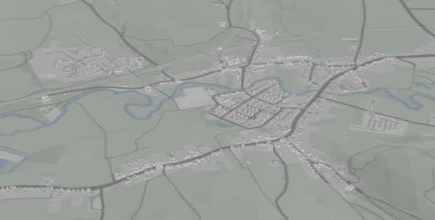

# DeckGL 3D Tileset Demo

This demo showcases rendering of 3D Tileset ([3D Tiles](https://www.ogc.org/standard/3dtiles/)) in web using [Next.js](https://nextjs.org/) using [DeckGL](https://deck.gl/) framework.

Mapbox is used to retrieve terrain and surface image in order to create DeckGL terrain layer.

Tileset is located in the `/public/tileset` folder.

## Findings

Tileset disappears under certain camera angles. There are cuts between chunks of terrains provided by Mapbox.

After extensive debugging - moved to Cesium.js for further projects. DeckGL isn't used by community for GIS / CityGML related projects as much.

If some good soul finds this repository and finds the problem behind the tileset disappearing, please let me know why :)
